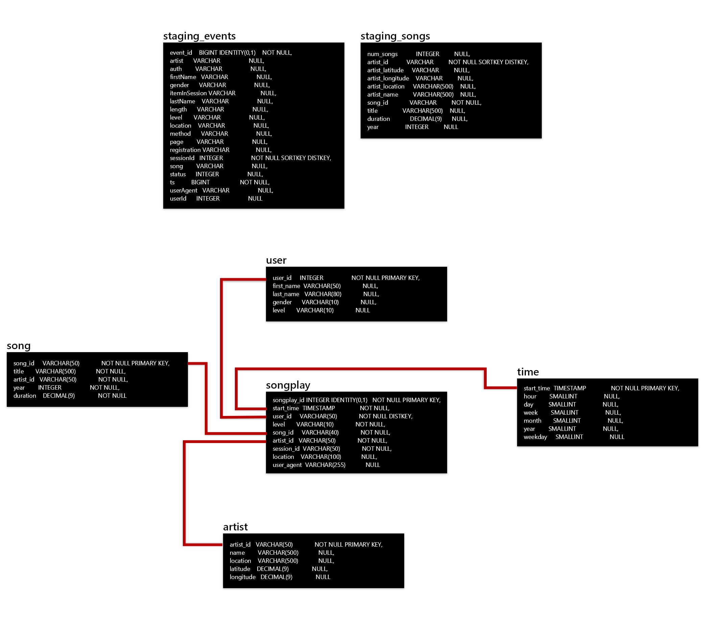
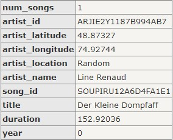

 

# Udacity Data Engineering Nanodegree | Data Warehouse Project

 

### *Arsalan Noorafkan*

**2021-03-14**
 
 

# **Overview**
## Background

Sparkify is a music streaming app and the data engineering team is tasked with building a process for extracting JSON files from S3, transforming into dimensional tables in Redshit, and loading data into a star schema database for the analytics team explore insights like what songs their users are listening to. The extracted JSON files contain information about user activity and metadata on songs. The data engineering team will develop a pipeline and test it by running queries given by the analytics team and comparing results with expected results. 

##### ***These facts are for a fictional company that does not exist in real life***

 

## Purpose

As a startup, Sparkify's analytics team needs a fast and accurate process for answering questions that support business decisions. However, since the data collected from users is rapidly increasing as they grow the business, hence, the raw data needs to be cleaned, transformed, and prepared as a star schema optimized for queries on song play analysis. The ETL process helps the analytics team work with a relational database instead of raw JSON files. 

 

---

 

# **Schema**

The database will be structured as a star schema that comprises of a fact table with multiple dimension tables. This schema creates denormalized tables that help simplify queries and enable faster aggregations even when using lots of group by, joins, having, and where clauses. It must be noted that a star schema may be less flexible when working on ad-hoc queries and many-to-many relationships are not supported. 

### **Fact Table**
* songplays - records in event data associated with song plays i.e. records with page NextSong
      `songplay_id, start_time, user_id, level, song_id, artist_id, session_id, location, user_agent`

### **Dimension Tables**
* users - users in the app
      `user_id, first_name, last_name, gender, level`
* songs - songs in music database
      `song_id, title, artist_id, year, duration`
* artists - artists in music database
      `artist_id, name, location, lattitude, longitude`
* time - timestamps of records in songplays broken down into specific units
      `start_time, hour, day, week, month, year, weekday`

### **Schema Diagram** 

 
 
 

# **Instructions**
## Specifications
The ETL process comprises of the following technical specifications:
- Raw data is provided as JSON files stored in S3

    * SONG_DATA = 's3://udacity-dend/song_data'
      
        * SONGS_JSONPATH = 's3://udacity-dend/songs_json_path.json'
        * Sample data:
      
        
      
    * LOG_DATA = 's3://udacity-dend/log-data'
     
        * LOG_JSONPATH = 's3://udacity-dend/log_json_path.json'
        * Sample data:
      
        
      
- ETL script is written in Python
    - Python libraries include Pandas and Psycopg2 (PSQL Adapter), Boto3 (AWS), Config Parser, and JSON
- AWS resources: Redshift database cluster and IAM role

 

## Project Structure
- dwh.cfg: AWS configuration and authentication
- sql_queries.py: SQL statements, imported into the two other files below
- create_tables.py: create fact and dimension tables for the star schema in Redshift
- etl.py: load data from S3 into staging tables on Redshift and then process that data into analytics tables

  

## Steps
The ETL process comprises of the following steps:
1) Initialize AWS instances and IAM roles for Redshift
2) Configure database connection and create tables
3) Load raw data from S3 to staging tables on Redshift
4) Load staging tables to analytics tables on Redshift
5) Delete Redshift cluster when analysis is completed

REMINDER: Do not include your AWS access keys in your code when sharing this project!

 

## Testing Script
Follow the steps below to test the ETL process using sample JSON data files.

1) Install Python libraries
2) Create AWS resources
    - Redshift dc2.large cluster with 4 nodes has been created in us-west-2
    - Set up AWS IAM roles with AmazonS3ReadOnlyAccess or equivalent access
    - Enter AWS config and authentication information in the dwh.cfg file
2) Open a terminal window and cd to the folder that contains the etl.py file
    > cd c:/usr/documents/Project1

3) Run the create_tables.py script to initiate database
    > python create_tables.py

3) Run the etl.py script to extract data from JSON files and update star schema database
    > python etl.py

 
 

---

 

